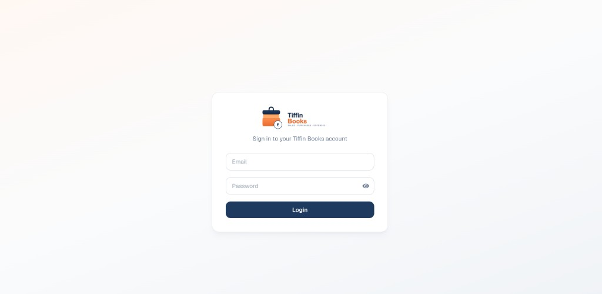
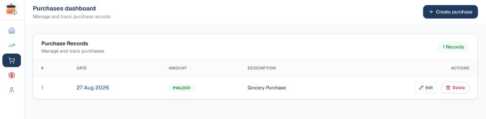
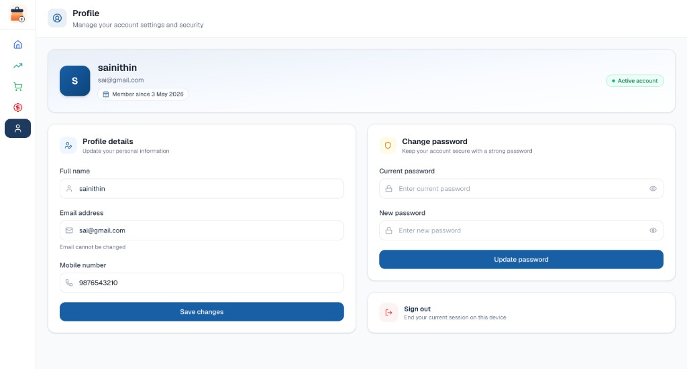

<p align="center">
  
</p>

<h1 align="center">Tiffin Books</h1>

<p align="center">
  <strong>Sales · Purchases · Expenses</strong><br />
  A clean finance dashboard for tiffin shop owners to track daily books.
</p>

<p align="center">
  <a href="https://tiffinbooks.vercel.app/">
    
  </a>
</p>

<p align="center">
  
</p>

---

## Live demo

**App:** [https://tiffinbooks.vercel.app/](https://tiffinbooks.vercel.app/)

---

## Screenshots

### Login

<p align="center">
  
</p>

### Purchases

<p align="center">
  
</p>

### Profile

<p align="center">
  
</p>

---

## Overview

**Tiffin Books** is a Next.js web app that helps tiffin / hotel businesses manage day-to-day finances in one place:

| Module | What you can do |
| --- | --- |
| **Dashboard** | See sales, purchases, expenses, and profit at a glance |
| **Sales** | Record morning & evening sales, charts, filters, pagination |
| **Purchases** | Log purchase amounts and descriptions |
| **Expenses** | Track expense purpose, amount, and date with filters |
| **Profile** | Update profile, change password, and sign out |

The UI is mobile-friendly (bottom nav) and desktop-friendly (collapsible sidebar with brand logo).

---

## Features

- **Auth-protected routes** — login required for all finance pages
- **Dashboard overview** — KPI cards, cashflow chart, recent activity
- **Shared date filters** — All / Today / Week / Month / Year / Custom
- **Sales insights** — morning & evening trends, metrics, records table
- **Expenses & purchases** — create, edit, delete with confirmation
- **Profile & security** — update details, change password, sign out
- **Skeleton loading** — layout stays stable while data loads
- **Light UI** — forced light color-scheme so forms stay readable on dark OS settings
- **Brand identity** — Tiffin Books logo & app icon throughout

---

## Tech stack

| Layer | Tools |
| --- | --- |
| Framework | [Next.js](https://nextjs.org) 16 (App Router) |
| UI | React 19, Tailwind CSS 4, Lucide icons |
| Charts | Recharts |
| HTTP | Axios |
| Language | TypeScript |
| Hosting | [Vercel](https://tiffinbooks.vercel.app/) |

---

## Project structure

```text
app/
  (protected)/
    dashboard/     # Overview + parallel recent activity slots
    sales/         # Sales dashboard
    purchases/     # Purchases dashboard
    expenses/      # Expenses dashboard
    profile/       # Account & sign out
  components/      # Shared UI (filters, tables, charts, skeletons)
  lib/apis/        # API clients (dashboard, sales, expenses, …)
  login/           # Login page
public/
  logo2.svg        # Full wordmark
  favicon.png      # App icon
docs/images/       # README screenshots & brand assets
```

---

## Getting started

### 1. Prerequisites

- Node.js 18+ (recommended: current LTS)
- A running **backend API** that exposes the finance endpoints

### 2. Install dependencies

```bash
npm install
```

### 3. Environment

Copy the example env and set your API base URL:

```bash
cp example.env .env
```

```env
NEXT_PUBLIC_API_URL=http://localhost:8000/api
```

> The frontend talks to this base URL for `/auth`, `/dashboard`, `/sales`, `/expenses`, `/purchases`, etc.

### 4. Run locally

```bash
npm run dev
```

Open [http://localhost:3000](http://localhost:3000).

### 5. Production build

```bash
npm run build
npm start
```

---

## API filter conventions

Dashboard, sales, and expenses share the same time-range query style:

| UI | Request example |
| --- | --- |
| All time | `GET /dashboard` *(no filter)* |
| Today | `GET /dashboard?filter=today` |
| This week | `GET /sales?filter=weekly&page=1&per_page=50` |
| Custom | `GET /expenses?filter=custom&startDate=2026-05-10&endDate=2026-05-15` |

Custom ranges always use **`startDate`** and **`endDate`** (`YYYY-MM-DD`).

---

## Scripts

| Command | Description |
| --- | --- |
| `npm run dev` | Start development server |
| `npm run build` | Create production build |
| `npm start` | Serve production build |
| `npm run lint` | Run ESLint |

---

## Brand assets

| Asset | Path |
| --- | --- |
| Wordmark | [`public/logo2.svg`](public/logo2.svg) · [`docs/images/logo.svg`](docs/images/logo.svg) |
| App icon | [`public/favicon.png`](public/favicon.png) · [`docs/images/icon.png`](docs/images/icon.png) |
| Login | [`docs/images/login.png`](docs/images/login.png) |
| Purchases | [`docs/images/purchases.png`](docs/images/purchases.png) |
| Profile | [`docs/images/profile.png`](docs/images/profile.png) |

---

## Deploy

Live production app: **[https://tiffinbooks.vercel.app/](https://tiffinbooks.vercel.app/)**

To deploy your own copy on [Vercel](https://vercel.com):

1. Connect the repo
2. Set `NEXT_PUBLIC_API_URL` to your production API
3. Deploy

---

## License

Private project — all rights reserved unless otherwise stated.
